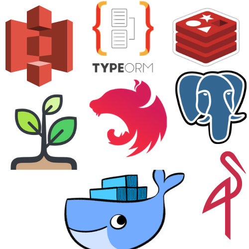

<p align="center">
  
</p>

# NestJS API Boilerplate

Nestjs API Boilerplate: Typescript, Postgresql, TypeORM, Swagger for Api documentation, Passport-JWT authentication, Jest, Env configuration, Migrations, Seeds, Docker, most popular node js libraries, and best application architecture.

> This is an a personal effort made with love to setup this architecture and dev environment for new node projects using [NestJS](https://nestjs.com).

## Getting started (development envioroment) 👍👍👍

```bash
# 1. Clone the repository or click on "Use this template" button.
git clone https://github.com/MidoAhmed/nestjs-api-boilerplate nestjs-api-boilerplate

# 2. Enter your newly-cloned folder.
cd nestjs-api-boilerplate

# 3. Install dependencies.
npm i

# 4. fill in default.yml.example and development.yml.example files and rename it to default.yml and development.yml

# 5. Run docker containers
npm run docker:up
# you can verify your DB by opening http://localhost:8080 (Adminer)

# 6. Run development server 
npm run start:dev 
# access swagger api doc by opening http://localhost:3000/docs
🥳🥳🥳

# 7. Read the documentation linked below for "Setup and development" (Sorry ! it is not yet available).
```

## Deploy (production envioroment) 👍👍👍

```bash
# 1. fill in .env.example file and rename it to .env 

# 2. Enter your project folder.
cd nestjs-api-boilerplate

# 2. Install dependencies.
sh scripts/deploy.prod.sh 

# 3. Enjoy it 🥳🥳🥳  you have your api up ! 😌

# NB : 🤔 to shut down production 
sh scripts/down.prod.sh

```

## Features

<dl>
  <dt><b>Quick scaffolding</b></dt>
  <dd>Create modules, services, controller - right from the CLI!</dd>

  <dt><b>Developer friendly</b></dt>
  <dd>Enjoy the best Developer eXperience.</dd>

  <dt><b>JWT Authentication</b></dt>
  <dd>Installed and configured JWT authentication.</dd>

  <dt><b>Next generation Typescript</b></dt>
  <dd>Always up to date typescript version.</dd>

  <dt><b>best application architecture</b></dt>
  <dd>Empowered with best practices facilitating the development of scalable server-side applications</dd>

  <dt><b>Environment Configuration</b></dt>
  <dd>development, staging and production environment configurations</dd>

  <dt><b>Swagger Api Documentation</b></dt>
  <dd>Already integrated API documentation. To see all available endpoints visit http://localhost:3000/docs</dd>

  <dt><b>Seeding Database</b></dt>
  <dd>Awesome way to seed test data into your database using typeorm-seeding</dd>

  <dt><b>Migrations</b></dt>
  <dd>Already provided and configured npm script commands to run our migration process, see 'migrations.doc.txt'</dd>

  <dt><b>Caching</b></dt>
  <dd>high performance data access using Redis store</dd>
  
  <dt><b>Documentation</b></dt>
  <dd>Already setup Compodoc</dd>

  <dt><b>Production grade logging system</b></dt>
  <dd>Setup an external logger for production grade logging system - winston</dd>

  <dt><b>AWS S3</b></dt>
  <dd>AWS SDK used for S3, tested with MinIO Server</dd>

  <dt><b>Linter</b></dt>  
  <dd>tslint + eslint + prettier = ❤️</dd>

</dl>

## WIP/Comming Features

<dl>
  <dt><b>TypeScript source code Documentation</b></dt>
  <dd>Use a documentation generator for TypeScript projects such as or other alternative - https://typedoc.org/</dd>
</dl>


## Documentation [Sorry ! it is not yet available]

This project includes a `docs` folder with more details on:

1.  [Setup and development](#) 
1.  [Architecture](#)
